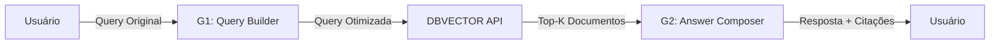

# 🔗 Integração RAG Pipeline - Guia Completo

## Visão Geral

Este documento descreve como integrar o pipeline RAG completo (G1 + G2) em sua aplicação.

## 🎯 Pipeline RAG Completo



## 📦 Componentes

### 1. G1 - Query Builder (`useQueryBuilder`)
**Responsabilidade**: Otimizar queries do usuário para busca vetorial

**Input**:
```typescript
{
  user_query: string,
  recent_history?: string,
  cluster_names?: string[]
}
```

**Output**:
```typescript
{
  optimized_query: string,    // "prisão preventiva art. 312 requisitos"
  tokens_count: number,        // 5
  used_clusters: string[]      // ["art. 312"]
}
```

### 2. DBVECTOR API (FastAPI Backend)
**Responsabilidade**: Busca vetorial/híbrida em documentos jurídicos

**Endpoint**: `POST /search`
```json
{
  "q": "prisão preventiva art. 312 requisitos",
  "k": 5
}
```

**Response**:
```json
{
  "query": "prisão preventiva art. 312 requisitos",
  "total": 5,
  "backend": "faiss",
  "results": [
    {
      "id": "doc_123",
      "text": "...",
      "score": 0.85,
      "article": "art. 312",
      ...
    }
  ]
}
```

### 3. G2 - Answer Composer (`useAnswerComposer`)
**Responsabilidade**: Gerar resposta final com citações

**Input**:
```typescript
{
  user_prompt: string,              // Query original do usuário
  recent_history?: string,          // Histórico de conversação
  retrieved: RetrievedDocument[]    // Documentos do DBVECTOR
}
```

**Output**:
```typescript
{
  answer: string,                   // Resposta com citações [doc_id]
  citations_used: string[],         // ["doc_123", "doc_456"]
  coverage_level: 'high' | 'medium' | 'low' | 'none',
  suggestions?: string[]            // Se cobertura baixa
}
```

## 🚀 Implementação Passo a Passo

### Passo 1: Setup Inicial

```typescript
// Em seu componente Vue/composable
const { optimizeQuery } = useQueryBuilder()
const { search } = useVectorSearch()
const { composeAnswer, convertToRetrievedDocuments } = useAnswerComposer()
```

### Passo 2: Pipeline RAG Completo

```typescript
async function runRAGPipeline(userQuery: string, history: string = '') {
  try {
    // 1️⃣ G1: Otimizar query
    console.log('🔍 Otimizando query...')
    const optimized = await optimizeQuery({
      user_query: userQuery,
      recent_history: history,
      cluster_names: ['art. 312', 'art. 319', 'art. 323', ...]
    })
    
    console.log('✅ Query otimizada:', optimized.optimized_query)
    
    // 2️⃣ Buscar no DBVECTOR
    console.log('📚 Buscando documentos...')
    const searchResults = await search(optimized.optimized_query, {
      k: 5,
      optimize: false  // Já otimizada no passo 1
    })
    
    console.log('✅ Documentos encontrados:', searchResults.total)
    
    // 3️⃣ Converter para formato do Answer Composer
    const retrievedDocs = convertToRetrievedDocuments(searchResults.results)
    
    // 4️⃣ G2: Compor resposta com citações
    console.log('✍️ Gerando resposta...')
    const answer = await composeAnswer({
      user_prompt: userQuery,
      recent_history: history,
      retrieved: retrievedDocs
    })
    
    console.log('✅ Resposta gerada com', answer.citations_used.length, 'citações')
    
    return {
      query_original: userQuery,
      query_optimized: optimized.optimized_query,
      documents_found: searchResults.total,
      answer: answer.answer,
      citations: answer.citations_used,
      coverage: answer.coverage_level,
      suggestions: answer.suggestions
    }
    
  } catch (error) {
    console.error('❌ Erro no pipeline RAG:', error)
    throw error
  }
}
```

### Passo 3: Usar na Interface

```typescript
// Estado reativo
const response = ref('')
const citations = ref<string[]>([])
const coverageLevel = ref<'high' | 'medium' | 'low' | 'none'>('none')
const suggestions = ref<string[]>([])

// Função de busca
async function handleSearch(query: string) {
  const result = await runRAGPipeline(query)
  
  // Atualizar UI
  response.value = result.answer
  citations.value = result.citations
  coverageLevel.value = result.coverage
  suggestions.value = result.suggestions || []
}
```

## 🎨 Componentes UI

### 1. Input com Modo Toggle

```vue
<template>
  <div>
    <!-- Toggle RAG / Chat -->
    <div class="mode-toggle">
      <button @click="mode = 'rag'" :class="{ active: mode === 'rag' }">
        🔍 RAG (Busca Vetorial)
      </button>
      <button @click="mode = 'chat'" :class="{ active: mode === 'chat' }">
        💬 Chat Simples
      </button>
    </div>
    
    <!-- Input -->
    <input 
      v-model="query" 
      @keyup.enter="mode === 'rag' ? handleRAG() : handleChat()"
      placeholder="Digite sua pergunta..."
    />
  </div>
</template>
```

### 2. Resposta com Citações

```vue
<template>
  <div v-if="response" class="response-box">
    <!-- Header com badges -->
    <div class="header">
      <h3>Resposta da IA (RAG)</h3>
      <div class="badges">
        <Badge :color="coverageColor">{{ coverageText }}</Badge>
        <Badge v-if="citations.length > 0">
          📚 {{ citations.length }} citações
        </Badge>
      </div>
    </div>
    
    <!-- Resposta -->
    <div class="answer">
      {{ response }}
    </div>
    
    <!-- Citações -->
    <div v-if="citations.length > 0" class="citations">
      <h4>📖 Fontes Citadas:</h4>
      <div class="citation-list">
        <Badge v-for="cite in citations" :key="cite">
          [{{ cite }}]
        </Badge>
      </div>
    </div>
    
    <!-- Sugestões (se cobertura baixa) -->
    <div v-if="suggestions.length > 0" class="suggestions">
      <h4>💡 Sugestões para melhorar a busca:</h4>
      <ul>
        <li v-for="sug in suggestions" :key="sug">{{ sug }}</li>
      </ul>
    </div>
  </div>
</template>
```

### 3. Documentos Recuperados

```vue
<template>
  <div v-if="documents.length > 0" class="documents-box">
    <h4>📚 Documentos Relevantes ({{ documents.length }})</h4>
    <div class="document-list">
      <div 
        v-for="(doc, idx) in documents" 
        :key="doc.id"
        class="document-card"
      >
        <div class="doc-header">
          <span class="doc-number">[{{ idx + 1 }}]</span>
          <span class="doc-title">{{ doc.article || 'Documento' }}</span>
          <span class="doc-score">{{ doc.score.toFixed(3) }}</span>
        </div>
        <div class="doc-snippet">
          {{ doc.text.substring(0, 200) }}...
        </div>
      </div>
    </div>
  </div>
</template>
```

## 🔄 Fluxos Alternativos

### 1. Modo Chat Simples (sem RAG)

```typescript
async function handleChatMode(query: string) {
  // Pula G1 e DBVECTOR, vai direto pro GPT
  const result = await $fetch('https://api.openai.com/v1/chat/completions', {
    method: 'POST',
    headers: { ... },
    body: {
      model: 'gpt-4o-mini',
      messages: [
        { role: 'user', content: query }
      ]
    }
  })
  
  return result.choices[0].message.content
}
```

### 2. RAG com Query Optimization Opcional

```typescript
async function runRAGPipeline(query: string, optimize = true) {
  let searchQuery = query
  
  if (optimize) {
    // Com G1
    const optimized = await optimizeQuery({ user_query: query })
    searchQuery = optimized.optimized_query
  }
  
  // Resto do pipeline...
}
```

### 3. Re-rank com Múltiplos Backends

```typescript
async function hybridSearch(query: string) {
  // Busca em FAISS
  const faissResults = await search(query, { backend: 'faiss', k: 10 })
  
  // Busca em OpenSearch (BM25)
  const osResults = await search(query, { backend: 'opensearch', k: 10 })
  
  // Reciprocal Rank Fusion
  const merged = mergeResults(faissResults, osResults)
  
  // Compor resposta com top-K final
  return composeAnswer({
    user_prompt: query,
    retrieved: merged.slice(0, 5)
  })
}
```

## ⚙️ Configuração Avançada

### 1. Ajustar Thresholds de Cobertura

```typescript
// Em useAnswerComposer.ts
function assessCoverage(retrieved: RetrievedDocument[]) {
  if (retrieved.length === 0) return 'none'
  
  const avgScore = retrieved.reduce((sum, doc) => sum + doc.score, 0) / retrieved.length
  
  // Ajuste estes valores conforme necessário
  if (retrieved.length >= 3 && avgScore >= 0.7) return 'high'    // ← Ajustar
  if (retrieved.length >= 2 && avgScore >= 0.5) return 'medium'  // ← Ajustar
  if (retrieved.length >= 1) return 'low'
  
  return 'none'
}
```

### 2. Customizar Prompts

```typescript
// Query Builder
function buildPrompt(input: QueryBuilderInput): string {
  return `Você é o GPT-5 Query Builder...
  
  SUAS CUSTOMIZAÇÕES AQUI
  
  - Priorize sempre artigos de lei
  - Use linguagem técnica jurídica
  - ...`
}

// Answer Composer
function buildSystemPrompt(): string {
  return `Você é o GPT-5 Answer Composer...
  
  SUAS CUSTOMIZAÇÕES AQUI
  
  - Formato de citação: [doc_id]
  - Tom: formal/informal
  - ...`
}
```

### 3. Adicionar Histórico de Conversação

```typescript
// Manter histórico
const conversationHistory = ref<Array<{ role: string, content: string }>>([])

async function runRAGWithHistory(query: string) {
  // Montar histórico em texto plano
  const history = conversationHistory.value
    .map(msg => `${msg.role}: ${msg.content}`)
    .join('\n')
  
  const result = await runRAGPipeline(query, history)
  
  // Adicionar ao histórico
  conversationHistory.value.push(
    { role: 'user', content: query },
    { role: 'assistant', content: result.answer }
  )
  
  return result
}
```

## 📊 Métricas e Monitoramento

### 1. Logging Estruturado

```typescript
interface RAGMetrics {
  timestamp: string
  user_query: string
  optimized_query: string
  documents_found: number
  avg_score: number
  citations_count: number
  coverage_level: string
  latency_ms: {
    query_builder: number
    vector_search: number
    answer_composer: number
    total: number
  }
}

async function runRAGWithMetrics(query: string): Promise<RAGMetrics> {
  const startTime = Date.now()
  const metrics: Partial<RAGMetrics> = {
    timestamp: new Date().toISOString(),
    user_query: query
  }
  
  // G1
  const t1 = Date.now()
  const optimized = await optimizeQuery({ user_query: query })
  metrics.optimized_query = optimized.optimized_query
  
  // DBVECTOR
  const t2 = Date.now()
  const searchResults = await search(optimized.optimized_query)
  metrics.documents_found = searchResults.total
  metrics.avg_score = searchResults.results.reduce((sum, r) => sum + r.score, 0) / searchResults.total
  
  // G2
  const t3 = Date.now()
  const answer = await composeAnswer({
    user_prompt: query,
    retrieved: convertToRetrievedDocuments(searchResults.results)
  })
  metrics.citations_count = answer.citations_used.length
  metrics.coverage_level = answer.coverage_level
  
  const t4 = Date.now()
  
  metrics.latency_ms = {
    query_builder: t2 - t1,
    vector_search: t3 - t2,
    answer_composer: t4 - t3,
    total: t4 - startTime
  }
  
  console.log('📊 RAG Metrics:', metrics)
  return metrics as RAGMetrics
}
```

### 2. Dashboard de Performance

```vue
<template>
  <div class="metrics-dashboard">
    <h3>📊 Métricas da Última Consulta</h3>
    
    <div class="metric">
      <span>Query Builder:</span>
      <span>{{ metrics.latency_ms.query_builder }}ms</span>
    </div>
    
    <div class="metric">
      <span>Vector Search:</span>
      <span>{{ metrics.latency_ms.vector_search }}ms</span>
    </div>
    
    <div class="metric">
      <span>Answer Composer:</span>
      <span>{{ metrics.latency_ms.answer_composer }}ms</span>
    </div>
    
    <div class="metric total">
      <span>Total:</span>
      <span>{{ metrics.latency_ms.total }}ms</span>
    </div>
    
    <div class="stats">
      <div>Documentos: {{ metrics.documents_found }}</div>
      <div>Score médio: {{ metrics.avg_score.toFixed(3) }}</div>
      <div>Citações: {{ metrics.citations_count }}</div>
      <div>Cobertura: {{ metrics.coverage_level }}</div>
    </div>
  </div>
</template>
```

## 🔐 Segurança

### 1. Rate Limiting

```typescript
// Rate limiter simples
const rateLimiter = {
  requests: [] as number[],
  maxRequests: 10,  // 10 requests
  windowMs: 60000,  // por minuto
  
  check(): boolean {
    const now = Date.now()
    this.requests = this.requests.filter(t => now - t < this.windowMs)
    
    if (this.requests.length >= this.maxRequests) {
      return false  // Rate limit exceeded
    }
    
    this.requests.push(now)
    return true
  }
}

async function handleSearch(query: string) {
  if (!rateLimiter.check()) {
    throw new Error('Muitas requisições. Aguarde um momento.')
  }
  
  return runRAGPipeline(query)
}
```

### 2. Validação de Input

```typescript
function validateQuery(query: string): void {
  if (!query || query.trim().length < 2) {
    throw new Error('Query muito curta (mínimo 2 caracteres)')
  }
  
  if (query.length > 500) {
    throw new Error('Query muito longa (máximo 500 caracteres)')
  }
  
  // Evitar queries potencialmente maliciosas
  const dangerousPatterns = [/<script>/i, /javascript:/i, /onerror=/i]
  if (dangerousPatterns.some(pattern => pattern.test(query))) {
    throw new Error('Query contém conteúdo não permitido')
  }
}
```

## 🧪 Testes

### 1. Teste de Integração Completa

```typescript
describe('RAG Pipeline Integration', () => {
  it('should complete full pipeline successfully', async () => {
    const query = "Quais são os requisitos para prisão preventiva?"
    
    const result = await runRAGPipeline(query)
    
    expect(result.query_optimized).toBeTruthy()
    expect(result.documents_found).toBeGreaterThan(0)
    expect(result.answer).toContain('[')  // Tem citações
    expect(result.citations.length).toBeGreaterThan(0)
    expect(['high', 'medium', 'low', 'none']).toContain(result.coverage)
  })
})
```

## 📚 Recursos Adicionais

- [QUERY_BUILDER.md](./QUERY_BUILDER.md) - Documentação G1
- [ANSWER_COMPOSER.md](./ANSWER_COMPOSER.md) - Documentação G2
- [SETUP.md](./SETUP.md) - Guia de instalação
- [examples.query-builder.ts](./app/composables/examples.query-builder.ts) - Exemplos práticos

---

**Última Atualização**: 2025-01-05  
**Versão**: 1.0.0  
**Status**: ✅ Produção
